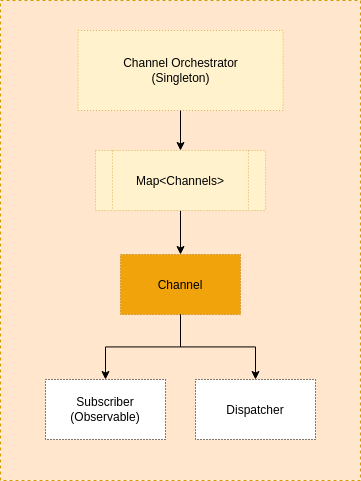

<p align="center">
  
</p>

<p align="center">A library for manipulate external communications between processes using RxJS.</p>

---

## Overview

The purpose of the library is to create a standard interface between channels to facilitate the orchestration of messages between processes, by default the channels are observables and it is implemented in a way where that you can subscribe to an observable to read messages and dispatch messages using the same interface.

Since messages between processes often use different providers that implement a certain infrastructure complexity (such as SQS, SNS, Redis, Kafka), the library does not provide any implementation beyond the base contract.

So you can see in the examples below how easy it would be to adapt creating an implementation respecting the interface that uses a provider, for example the AWS SQS (Simple queue service).

### Project architecture

The project's architecture basically consists of an orchestrator that controls a Channel hashmap that has a defined interface based on observables, each channel has the ability to publish (dispatch) messages and be subscribed to listen them.



### Installation

```bash
# Using NPM
$ npm install @prats-tech/rx-channels

---

# Using Yarn
$ yarn add @prats-tech/rx-channels
```

### Examples

#### Creating a sync channel

```typescript
import { ChannelOrchestrator } from '@prats-tech/rx-channels';


type SyncMessage {
  name: string;
  date: Date;
}

const orchestrator = ChannelOrchestrator.getInstance();

// Create your channel
orchestrator.addChannel({
  config: {
    name: 'channel-test',
  },
});

// Subscribe incoming messages
const channel = orchestrator.getChannelObservable('channel-test');
channel.subscribe<SyncMessage>({
  next: message => {
    console.log(message);
  },
});

// Dispatch your messages
const data: SyncMessage = {
  name: 'test',
  date: new Date()
};
orchestrator
  .dispatch<SyncMessage>('channel-test', data)
```

#### Creating a async channel

```typescript

import { Subject } from 'rxjs';

import { ChannelOrchestrator, ChannelInterface, ChannelType } from '@prats-tech/rx-channels';


type AyncMessage {
  name: string;
  date: Date;
}

class AsyncChannel implements ChannelInterface {
  private subject: Subject<any>;

  constructor() {
    this.subject = new Subject();
  }

  // implementation of send message for async provider
  private async sqsDispatch() {}

  // implementation of listen message from async provider
  private async sqsListen(message) {
    this.subject.next(message);
  }

  async dispatch<T = any>(message: T) {
    await this.sqsDispatch(message);
  }

  getObservable<T = any>() {
    return this.subject.asObservable();
  }

  getName() {
    return 'async-channel';
  };

  getType() {
    return ChannelType.Async;
  };
}

const orchestrator = ChannelOrchestrator.getInstance();

// Create your channel
orchestrator.addChannel({
  channel: new AsyncChannel()
});

// Subscribe incoming messages
const channel = orchestrator.getChannelObservable('channel-test');
channel.subscribe<AsyncMessage>({
  next: message => {
    console.log(message);
  },
});

// Dispatch your messages
const data: AsyncMessage = {
  name: 'test',
  date: new Date()
};
orchestrator
  .dispatch<AsyncMessage>('channel-test', data)
```

---

## License

MIT © [Prats](https://github.com/prats-tech)
